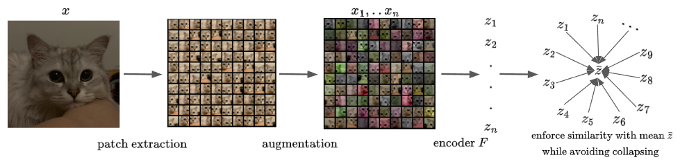

# EMP-SSL: Towards Self-Supervised Learning in One Training Epoch

[](https://arxiv.org/abs/2304.03977)





Authors: Shengbang Tong*, Yubei Chen*, Yi Ma, Yann Lecun

## Introduction
This repository contains the implementation for the paper "EMP-SSL: Towards Self-Supervised Learning in One Training Epoch." The paper introduces a simplistic but efficient self-supervised learning method called Extreme-Multi-Patch Self-Supervised-Learning (EMP-SSL). EMP-SSL significantly reduces the training epochs required for convergence by increasing the number of fix size image patches from each image instance.

## Getting Started

To get started with the EMP-SSL implementation, follow these instructions:

### 1. Clone this repository
```bash
git clone https://github.com/tsb0601/emp-ssl.git
cd emp-ssl
```
### 2. Install required packages
```
pip install -r requirements.txt
```
### 3. Training
Current code implementation supports cifar10, cifar100 and imagenet100. We will update more datasets in the future~
Change num_patches here to change the number of patches used in EMP-SSL training.
```
python train.py --data cifar10 --epoch 30 --patch_sim 200 --arch 'resnet18-cifar' --num_patches 20 --lr 0.3
```

### 4. Evaluating
Because our model is trained with only fixed size image patches. To evaluate the performance, we adopt bag-of-features model from intra-instance VICReg paper. Change test_patches here to adjust number of patches used in bag-of-feature model for different GPUs.
```
python evaluate.py --model_path 'path to your evaluated model' --test_patches 128
```

## Acknowledgment
This repo is inspired by [MCR2](https://github.com/Ma-Lab-Berkeley/MCR2), [solo-learn](https://github.com/vturrisi/solo-learn) and [NMCE](https://github.com/zengyi-li/NMCE-release) repo.

## Citation
If you find this repository useful, please consider giving a star :star: and citation:

```
@article{tong2023empssl,
title={EMP-SSL: Towards Self-Supervised Learning in One Training Epoch},
author={Shengbang Tong and Yubei Chen and Yi Ma and Yann Lecun},
journal={arXiv preprint arXiv:2304.03977},
year={2023}
}
```